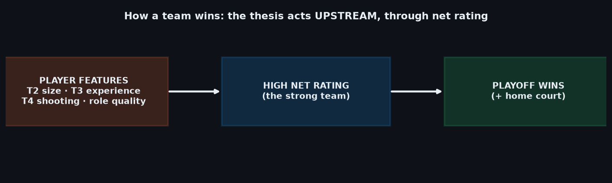
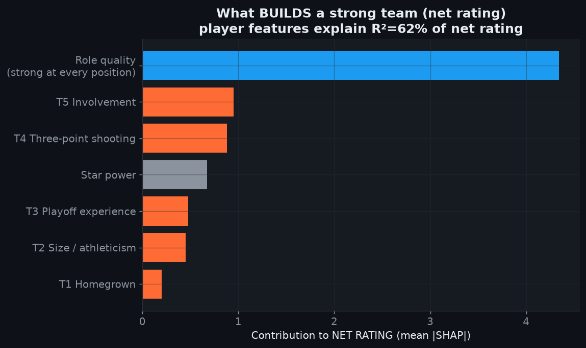
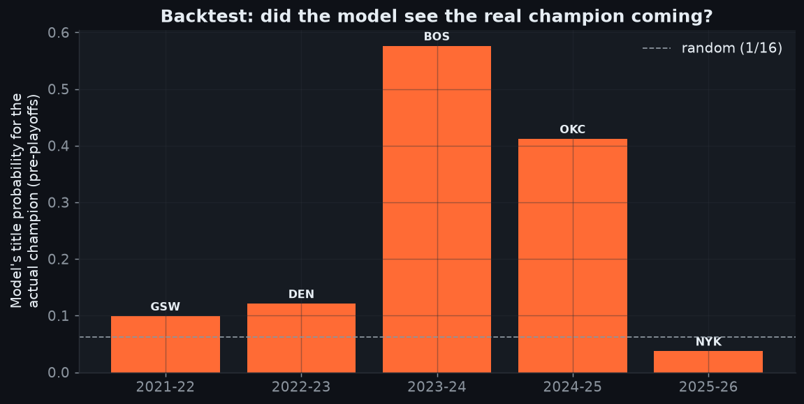
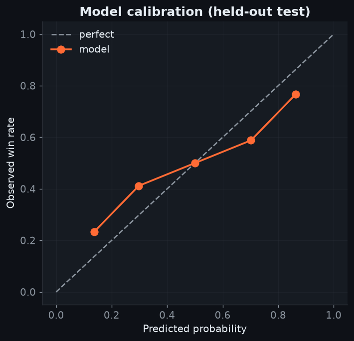

# 🏀 NBA Playoff Predictor

A statistical model that turns **regular-season data into series-by-series
playoff predictions** — and uses them to test a thesis: **what actually makes a
team win in the NBA?**

It builds a feature set from individual players (technical, physical/athletic,
career and role), aggregates it into team profiles, models a single best-of-7
series, and runs a Monte-Carlo bracket to produce every team's odds of advancing
each round and winning the title. Everything is validated **walk-forward**
(1996–2025) with **no data leakage**.

---

## 🎯 The thesis and the verdict

The starting hypothesis was that NBA winning is driven by five factors:

| | Factor |
|---|--------|
| **T1** | Homegrown players (drafted & developed in-house) |
| **T2** | Size & athleticism |
| **T3** | Playoff experience (weighted by real minutes played) |
| **T4** | Three-point shooting |
| **T5** | Involvement beyond the stars |

**What the data says — honestly:**

Predicting *who wins a series* is dominated by **net rating** and **home court**
(the better team usually wins). On their own, the thesis factors add modest value
to series prediction.

**But the thesis was right — it just acts one step upstream.** When we ask *what
builds a strong team* (high net rating), the player-derived factors explain
**~62% of net rating**, and the biggest drivers are exactly **role quality
(strong at every position), three-point shooting, star power and playoff
experience.**

```
   T4 three-point ┐
   T2 size        │
   T3 experience  ├──►  HIGH NET RATING  ──►  wins the playoffs
   role quality   │      (+ home court)
   star power     ┘
```

> The thesis doesn't win the series directly — it **builds the dominant team**
> that then wins. The record is not a tautology: it's the **mediator** through
> which the thesis works.




---

## 📊 How well does it predict?

Walk-forward validation, **20 train / 5 validation / 5 test** seasons. The test
block (2021-22 … 2025-26) is touched **only once**, for the final verdict.

| | Test accuracy | Log loss | Brier |
|---|---|---|---|
| **Series model** | 65–68% | 0.636 | 0.222 |
| Baseline (win%) | 70% | 0.558 | 0.190 |

- **Bracket backtest:** ~60–65% of first-round series correct; the model assigns
  the eventual champion **~4× the random (1/16) probability** before the playoffs
  start.
- **Calibrated:** when it says 80%, it happens ~75% of the time.




> ⚠️ *Honest note:* the playoffs are noisy and the sample is small (~16 titles in
> 30 years). The model is built on **series** (hundreds of examples), not titles,
> and it shows real but not magical skill. There is no "mathematical certainty"
> to winning a title — but there is a clear recipe for **being the team most
> likely to**.

---

## 🖥️ Interactive dashboard

```bash
pip install -r requirements.txt
streamlit run app.py
```

Three modes:
- **Historical season** — pick any season (1996-2025); the model trains only on
  prior seasons and predicts the bracket, round-by-round, with each team's title
  odds and every matchup's win probabilities for **both** teams.
- **Upload a season (JSON)** — drop a JSON with a finished regular season's
  per-player and per-team values; the full pipeline runs automatically and
  predicts that season's playoffs. See [`data/sample_new_season.json`](data/sample_new_season.json)
  for the exact format.
- **About the model** — the methodology and the causal chain.

---

## 🔬 How it works (the pipeline)

Full detail in **[docs/FEATURE_FLOW.md](docs/FEATURE_FLOW.md)**. In short:

1. **Players** → per-player-season features: technical stats, career (homegrown
   0-4, playoff experience **weighted by actual minutes**), physical/athletic
   (NBA Combine + a clustering proxy for players without Combine data), and a
   superstar→bench-warmer impact level.
2. **Teams** → player features are **minutes-weighted** into team profiles,
   broken down **by role band** (backcourt / wing / frontcourt) so matchups by
   role are visible, plus official team stats and **home/away splits**.
3. **Series** → XGBoost on the **difference** between two teams + head-to-head +
   **home court** → P(A wins the series), symmetric by construction.
4. **Bracket** → Monte-Carlo over the conference bracket → advancement and title
   odds.
5. **Thesis tests** → ablation (with/without T1-T5), thesis-only model, SHAP, and
   the net-rating driver analysis.

Data comes from `nba_api` (stats.nba.com), cached locally.

---

## 🗂️ Project structure

```
app.py                     interactive Streamlit dashboard
config.yaml                horizon, thresholds, parameters
src/
  collect/                 data collection (nba_api) + local cache
  features/                feature engineering: technical, career, physical,
                           role, level, home/away, team aggregation, selection
  model/                   series dataset, walk-forward, bracket, season report
  evaluate/                thesis test, SHAP, net-rating drivers
  ingest/                  ingest a new season from JSON → predictions
  viz/                     figure generation
docs/
  FEATURE_FLOW.md          how features combine (player → team → matchup)
reports/figures/           generated figures
data/                      raw cache / interim / processed (gitignored)
```

---

## 🔁 Reproduce everything

```bash
python -m src.collect.run_collection --start 1996 --end 2025   # collect (cached)
python -m src.collect.standings                                # conferences/seeds
python -m src.features.series                                  # series + head-to-head
python -m src.features.player_technical                        # technical block
python -m src.features.player_career                           # career (homegrown, exp)
python -m src.features.combine_proxy                           # physical + proxy
python -m src.features.player_level                            # impact levels
python -m src.features.player_role                             # role bands
python -m src.features.home_away                               # home/away splits
python -m src.features.team_features                           # team aggregation
python -m src.features.select_features                         # drop redundant features
python -m src.model.series_dataset                             # build series dataset
python -m src.model.walkforward                                # train + validate
python -m src.model.backtest_bracket                           # bracket backtest
python -m src.evaluate.thesis_test                             # ablation
python -m src.evaluate.what_builds_rating                      # net-rating drivers
python -m src.evaluate.shap_analysis                           # SHAP
python -m src.viz.make_figures                                 # all figures
```

---

## 📝 Notes & limitations

- Observational data: we show **strong association and predictive power**, not
  causation in the experimental sense.
- NBA Combine athleticism data starts in 2000; pre-2000 and undrafted players get
  proxy values via clustering (flagged).
- Injuries are irreducible noise — a title can swing on one — modeled as
  Monte-Carlo uncertainty.

---

*Built with Python · nba_api · XGBoost · SHAP · Streamlit.*
